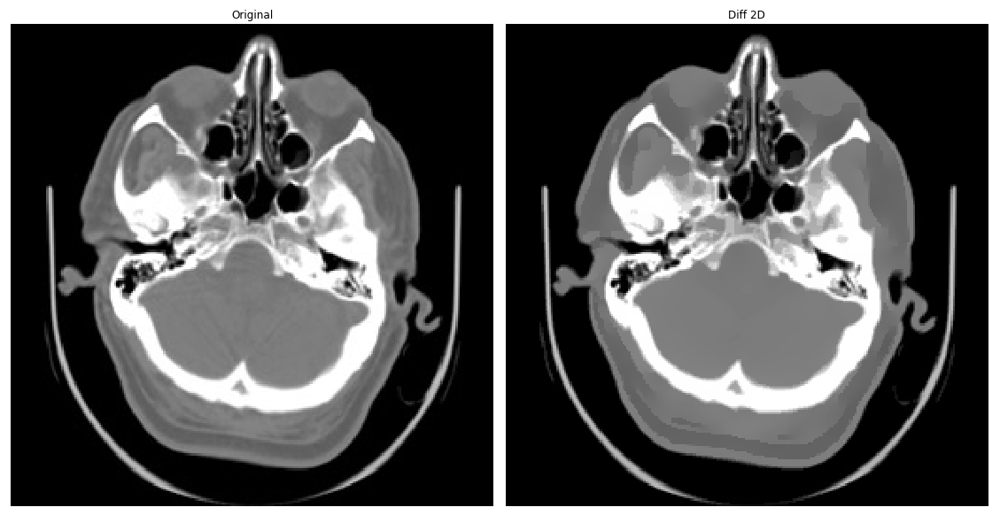

# fastaniso
## Fast anisotropic diffusion filter (2D and 3D) by ALI_M

This is another independent anisotropic filter implementation. Original code in Python 2 was made available at https://pastebin.com/u/ali_m  by Alistair Muldal, who is a Research Scientist at Google DeepMind. His Git is https://github.com/alimuldal. 

This my Git mirror, adapted to Python 3.

The methods called on the image in the code pressupose that you'll use the OpenCV image loading method. Do not try to load the image using e.g. SciKit Image load. 
